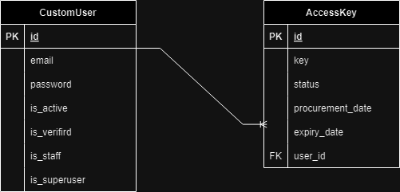

<h1 align="center">ACCESS KEY MANAGER</h1>

## Deployed Application

The Access Key Manager is deployed and accessible at the following link:

[Access Key Manager - Deployed Application](https://access-key-manager-mtco.onrender.com/)

**LINK**: https://access-key-manager-mtco.onrender.com/

---

<p align="center"> A Take-Home Project
    <br> 
</p>

## 📝 Table of Contents
- [TODO](#todo)
- [About](#about)
- [Getting Started](#getting_started)
- [Project Structure](#structure)
- [ER Diagram](#diagram)
- [Usage](#usage)
- [Built Using](#built_using)

## Todo <a name = "todo"></a>
See [TODO](./docs/TODO.md)

## 🎲About <a name = "about"></a>
Access Key Manager is a web application designed for managing multi-tenant access keys, especially for school management platforms. The application includes features like user registration, email verification, password reset, and key management. It is built using [these](#built_using) technologies.

## 🏁 Getting Started <a name = "getting_started"></a>
These instructions will get you a copy of the project up and running on your local machine for development and testing purposes.

### Prerequisites
- Postgres: A relational database(or your preferred database).
- Python 3.10^: The Python programming language.
- Django 5.0 or higher
- Courier: For email services
- AutoPEP8: An auto-formatter for Python code.


### Setting up a development environment
### Step 1: Clone the repository

```bash
https://github.com/RansfordGenesis/Access_Key_Manager.git
```

or with GithubCLI
  
```bash
gh repo clone RansfordGenesis/Access_Key_Manager
```


### step 2: Create a virtual environment

```bash
python -m venv venv
```
OR by using the virtualenvwrapper
```bash
  mkvirtualenv venv
```
Activate the virtual environment with 
```bash
source venv/bin/activate  # On Windows use `venv\Scripts\activate`

```

### Step 3: Install dependencies

```bash
pip install -r requirements.txt
```

> Note to add a package to the project, run

```bash
pip install <package-name>
```

### Step 4: Create a `.env` file in the project's root directory and add the following environment variables, replacing the placeholders with your specific values:

```bash
# Postgres env
DB_NAME = #eg. key_manager
DB_USER = #e.g postgres
DB_PASSWORD = #e.g password123
DB_HOST = #e.g localhost
DB_PORT = #e.g 5432


SECRET= #notasecretkey

# Email env
EMAIL_BACKEND = 'django.core.mail.backends.smtp.EmailBackend'
EMAIL_HOST = 'smtp.gmail.com'
EMAIL_PORT = 587
EMAIL_HOST_USER = #Email account
EMAIL_HOST_PASSWORD = #Email Password

# Courier env
COURIER_TOKEN = #API Token
ACTIVATE_TEMPLATE = #Activate Mail Template
RESET_TEMPLATE =  #Reset Mail Template

ADMIN_EMAIL = #Superuser email
ADMIN_PASSWORD = #Superuser password
```
> Note to uncomment postgres database in settings.py


### Step 5: Apply database migrations

```bash
    python manage.py migrate
```

### Step 6: Create a superuser

```bash
    python manage.py createsuperuser
```

or with command script
```bash
    python manage.py createsu
```

### Step 7: Run the development server
```bash
    python manage.py runserver
```


## ⚙️ Project Structure <a name = "structure"></a>
```s
Access_Key_Manager
├─ .gitignore
├─ Access_Key_Manager
│  ├─ asgi.py
│  ├─ settings.py
│  ├─ urls.py
│  ├─ wsgi.py
│  └─ __init__.py
├─ build.sh
├─ key_manager
│  ├─ admin.py
│  ├─ apps.py
│  ├─ migrations
│  │  ├─ 0001_initial.py
│  │  ├─ 0002_accesskey_key_alter_accesskey_date_of_procurement_and_more.py
│  │  ├─ 0003_alter_accesskey_key.py
│  │  └─ __init__.py
│  ├─ models.py
│  ├─ templates
│  │  └─ key_manager
│  │     ├─ base.html
│  │     └─ home.html
│  ├─ tests.py
│  ├─ urls.py
│  ├─ views.py
│  └─ __init__.py
├─ manage.py
├─ README.md
├─ requirements.txt
└─ users
   ├─ admin.py
   ├─ apps.py
   ├─ forms.py
   ├─ management
   │  └─ commands
   │     └─ createsu.py
   ├─ migrations
   │  ├─ 0001_initial.py
   │  └─ __init__.py
   ├─ models.py
   ├─ templates
   │  └─ users
   │     ├─ account_activated.html
   │     ├─ account_activation_invalid.html
   │     ├─ account_activation_sent.html
   │     ├─ account_already_verified.html
   │     ├─ login.html
   │     ├─ password_reset.html
   │     ├─ password_reset_complete.html
   │     ├─ password_reset_confirm.html
   │     ├─ password_reset_done.html
   │     ├─ password_reset_email.html
   │     ├─ password_reset_subject.txt
   │     └─ signup.html
   ├─ tests.py
   ├─ tokens.py
   ├─ utils.py
   ├─ views.py
   └─ __init__.py

```


## ✏️ER Diagram <a name="diagram"></a>
Below is the ER diagram for the Access Key Manager project:




## 🎈 Usage <a name="usage"></a>
### User Registration and Email Verification
1. **Sign Up**
    - Users can sign up using their email and password.
    - After signing up, an email will be sent to the user to verify their account.

2. **Email Verification**
    - Users need to click the link sent to their email to verify their account.
    - Once verified, they can log in to the system.

### Access Key Management
1. **Requesting a Key**
    - Normal users can request a new access key(only if no active key exists).
    - Admins can manage all the access keys.

2. **Viewing Keys**
    - Admins can view all the access keys in a paginated format, grouped by user email.
    - Users can view details and status of their access keys.

3. **Revoking Keys**
    - Admins can revoke keys that are currently active.

4. **Expiration of Keys**
    - Home function checks for expired keys and changes it's status.

5. **API endpoint**
    - The application has an endpoint to check active key details by school email.


## ⛏️ Built Using <a name = "built_using"></a>
- [Django](https://www.djangoproject.com/): The web framework used for building the application.
- [PostgreSQL](https://www.postgresql.org/): The database used for storing user and key information.
- [Bootstrap](https://getbootstrap.com/): The frontend framework for styling and responsive design.
- [Courier](https://www.courier.com/): For sending email notifications.
- [Render](https://render.com/): For hosting the application.